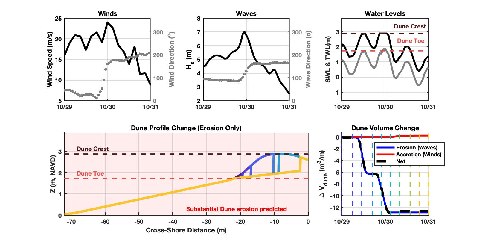

title: 'DRT: A rapid coastal foredune evolution prediction tool'
tags:
  - matlab
  - dunes
  - geomorphology
  - oceanography
  - storms
  - coastal
authors:
  - name: Nicholas Cohn^[Corresponding author: nicholas.t.cohn@erdc.dren.mil]
    orcid: 0000-0003-4287-039X
    affiliation: 1
  - name: Katherine Brodie
    orcid: 0000-0003-1945-5112
    affiliation: 1
affiliations:
 - name: U.S. Army Engineer Research and Development Center, Coastal and Hydraulics Laboratory
   index: 1
date: 1 December 2020
bibliography: paper.bib

---

# Summary

Coastal foredunes are the first line of defense against ocean-side flooding along many low-lying sandy coastlines. For this reason,
understanding when dunes will be eroded during major storm events and under which conditions these morphological
features will naturally grow from wind-driven processes is important for quantifying risk and vulnerability for coastal stakeholders. Numerous numerical models of varying complexity exist to simulate the accretion and erosion of coastal dunes. All such models require inputs such as wave, wind, and tidal forcing conditions, as well as information regarding the local topographic profile. However, acquiring these necessary site-specific characteristics, setting up numerical models with this information in the appropriate formats,
compiling and running models, and visualizing model output can take significant time and computational effort. These
barriers often limit the ability for non-experts to access or utilize dune modeling tools for planning or prediction purposes.

The Dune Response Tool ('DRT') was designed to be used by coastal practitioners for planning purposes and
for research applications, with minimal external input required. 'DRT' includes a series of matlab codes (\autoref{fig:fig1}) to download
relevant oceanographic and meteorological variables from public data sources for any ocean-fronting coastline in the continental US, which are used to force simple models for simulating dune erosion from
waves and for quantifying volumetric dune accretion from winds. These tools can be run in both hindcasting and forecasting modes, with
model simulations typically taking seconds to minutes to run for typical applications. The back-end codes are wrapped within
a graphical user interface (GUI, \autoref{fig:fig2}) to allow for straightforward field site selection and for visualizing model outputs.

#Statement of Need
Rapid predictive tools of coastal sediment transport and morphology change, even if they lack a full depiction of the relevant
hydrodynamic or morphdynamics processes, are important for understand coastal change hazards. In 'DRT' all
necessary pre-processing steps, model simulations, and visualizations for simple erosional and accretional dune volume change models have been included within a single package.
The codes pull publicly accessible environmental data sources, with these datasources as outlined in \autoref{fig:fig1}, differing for hindcast
and forecast modes based on (1) national scale data availability, (2) data accessibility (e.g., optimizing for fast download speeds and consistent server access),
and (3) data quality. End to end tools that are able to generate appropriate model boundary conditions through to generate output graphics are either cost prohibitive or out of
reach for the non-expert. This tool aims to provide an easy to use means to complete planning level assessments of dune erosion and growth, with datasets pre-loaded for the majority of the US coastline.

#'DRT' Workflow
The code includes pre-processing scripts which automatically download relevant oceanographic and meteorological variables from public data sources for
any ocean-fronting coastline in the continental US in both hindcasting (any date from 1980 to 2017) and
forecasting (now to 3 days from now) mode as shown in \autoref{fig:fig1}.

Simplified beach-dune profiles can be generated from a database of morphometric data compiled from @usgs2017 and @mull2014 that covers the majority of the U.S. oceanfront coastline. Where pre-compiled data does not exist or where the user wishes to input their own morphology information, this information can be input into the tool. A gridded profile is generated from the data in this step.

A simple 1D dune erosion model based on @Palmsten2012 has been implemented. The forcings are used to calculate volumetric dune erosion for a user-defined time interval. A set of equations for estimating wind-blown transport into dunes following the general approach of @Delgado2011, implementing the transport equation of @Kawamura1951, is also included.

The tool purposely has relatively few input parameters, although the user may modify relevant wind- and wave- related transport coefficients, as well as local grain size, wave runup modifiers, and morphologic parameters. A simple ensemble approach is added where a range of input parameters can be included to bound the solution and give a better sense of uncertainty of predictions for the end-user.

Although these various tools do not include all relevant morphodynamic processes controlled dune evolution during storms, the combination of approaches is purposely meant to provide a rapid answer for planning purposes. For more complicated cases, the code can be modified to ingest different data inputs or allow for new capabilities that are not yet incorporated.

#'DRT 'Example
An example of a model setup initialized on XXXXX at Latitude of and Longitude of XXXX of represents the model predicted erosion and accretion from Hurricane Sandy, as shown in \autoref{fig:fig3}. Consistent with XXXXXX, the tool shows destruction of the dune system over the time period. On a standard PC the tool took less than 30 seconds to download relevant environmental data from the web, run the model, and display the output.

#Installation
The code consists of a matlab-based .mlapp interface which calls a series of individual .m scripts, as described in \autoref{fig:fig1}. These scripts can also be run independently outside of the GUI.

In case of compatibility issues or non-access to Matlab, a compiled executable for the DRT GUI is provided on the site for Windows or MacOS platforms to make the tool more accessible to non-coders.

# Future Work
This initial tool development utilizes available datasets for a subset of the continental US. Future iterations could include morphologic datasets that also cover California, Hawaii, Alaska, and the Great Lakes region, as well as overseas regions. This initial domain was based on ease of access to data availability.

This tool relies of web access to various environmental datasets as well. Most of the these datasets reside on either THREDDS or ERDDAP servers, with the later platform generally being more stable. Based on model testing there is not 100% uptime in all of these data products which provides complications for running DRT if servers are down. Future iterations of the tool could add in new webservices and/or allow for easier ingestion of non-web-based environmental datasets.

# Acknowledgements
Development of 'DRT' was funded by the U.S. Army Engineer Research and Development Center's (ERDC) Coastal Inlets Research Program (CIRP).

# References
